# work&kite Website

The work&kite website is a landing page for a coworking space right at the kite spot.

On this website, users will find all the information they need about the equipment and service for both the coworking space and the Kiteboarding club. You can also send an inquiry if you have any questions or want to reserve a workspace.

[Live Projekt Here](https://kimmy-ka.github.io/work-kite/)

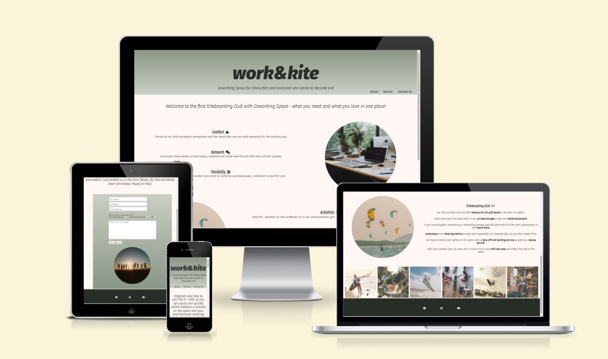

## CONTENTS

* [User Experience(UX)](User-Experience-(UX))
  * [User Stories](#User-Stories)
  
* [Design](#Design)
  * [Colour Scheme](#Colour-Scheme)
  * [Typography](#Typography)
  * [Images](#Images)
  * [Wireframes](#Wireframes)
  * [Features](#Features)
  * [Accessibility](#Accessibility)

* [Technologies Used](#Technologies-Used)
  * [Languages Used](#Languages-Used)
  * [Frameworks, Libraries & Programs Used](#Frameworks,-Libraries-&Programs-Used)

* [Deployment & Local Decelopment](#Deployment-&-Local-Decelopment)
  * [Deployment](#Deployment)
  * [Local Development](#Local-Deployment)
    * [How to Fork](#How-to-Fork)
    * [How to Clone](#How-to-Clone)

* [Testing](#Testing)
  * [W3C Validator](#W3C-Validator)
  * [Known Bugs](#Known-Bugs)
  * [Testing User Stories](#Testing-User-Stories)
  * [Lighthouse](#Lighthouse)

* [Credits](#Credits)
  * [Code](#Code)
  * [Media](#Media)
  * [Acknowledgments](#Acknowledgments)

- - -

## User Experience (UX)

### User Stories

#### Client Goals

* As a client, I want a simple and clear presentation of all information.
* As a client, I want to be able to view the side an a range of device sizes.
* As a client, I want users to be able to contact the work&kite team for questions and reservations.
* As a client, I want users to come back to my website regularly.

#### User Goals

* As a user, I want to be able to easily navigate the site and find the content I need.
* As a user, I would like to see all the services offered easily and clearly.
* As a user, I would like to be able to contact the website to ask questions or make a reservation.
* As a user, I would like to know when which events are taking place.

- - -

## Design

### Colour Scheme

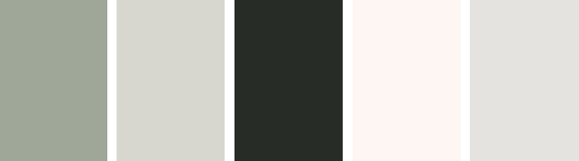

The website uses a palette of colors that is reflected in the photos on the website. The color palette was created using the [Coolors](https://coolors.co/) website.

### Typography

Google Fonts was used for the following fonts:

* Fira Sans was used for the entire website.
* Fira Sans was also used in italics, to create contrast.
* Fira Sans was used in the weights of 300-600.

### Images

The images on this webpage are all from Pexels. I've listed these in the Credits section.

### Wireframes

Wireframes were created for mobile, tablet, medium screen and big screen desktop.

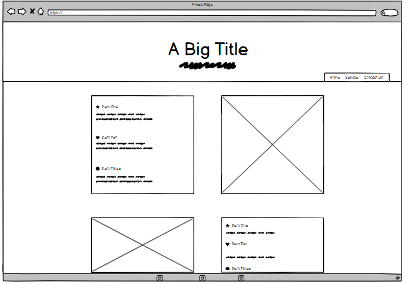
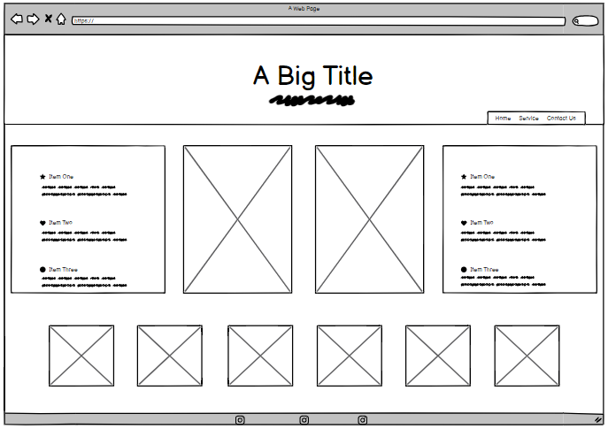
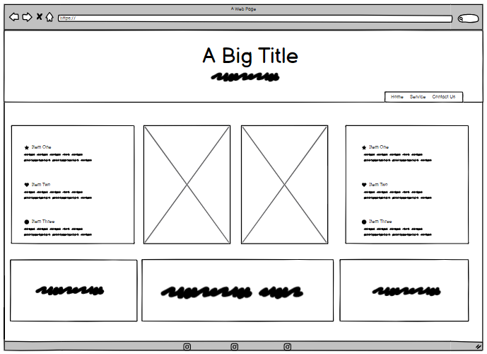
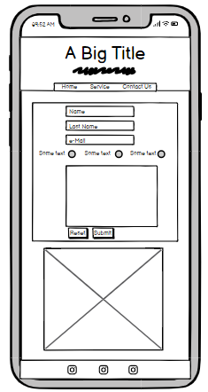
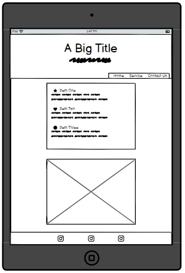
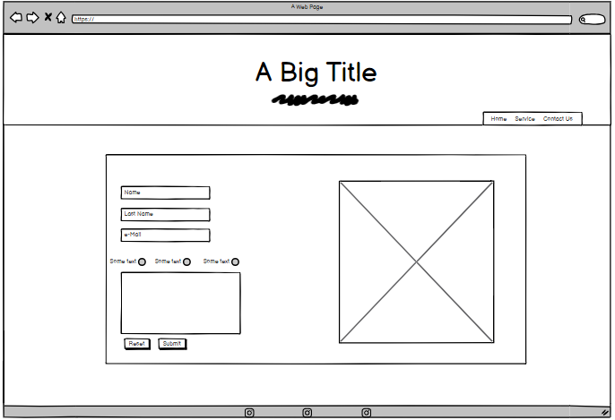

### Features

This website consists of three pages which can be reached via a navigation menu. There is a home, service and contact page.

* All pages of the web page have:
  
  * a header with the title and an explanatory sentence.
  * the work&kite title in the header serves as a link to the home page.
  * a responsive navigation bar with which the user can control the page.
  * a footer with links to socialmedia.
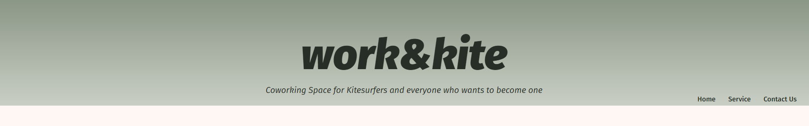
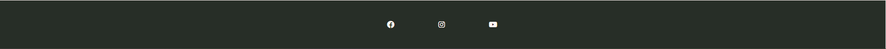
 
* Home Page:
  
  * a photo of a coworking space with a short text about the services of the coworking Space.
  * a photo of a kitesurfer with a short text about the services of the Kiteboarding club.
  * an area in which the weekly events are displayed.
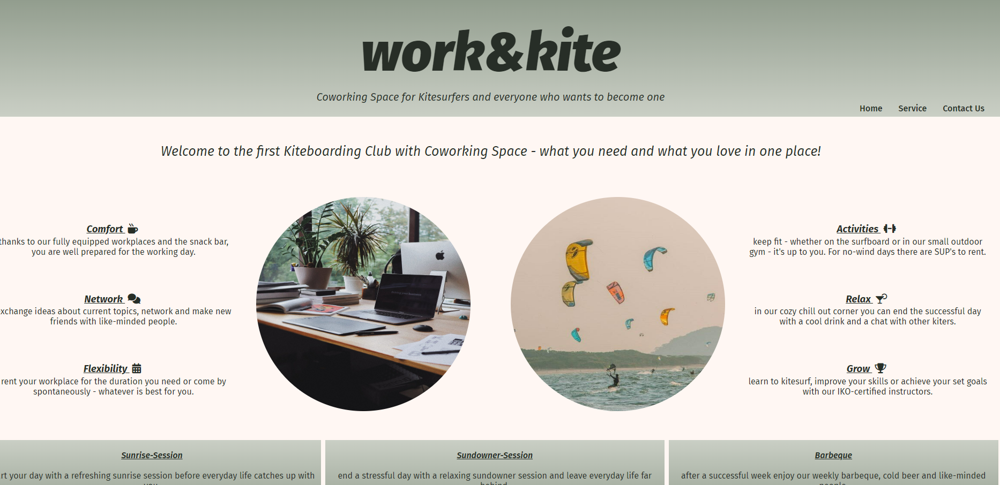

* Service Page:
  
  * a photo of a coworking space with detailed information on the facilities and services of the coworking space.
  * a photo of a kitesurfer with detailed information on the facilities and services of the Kiteboarding club.
  * an area in which images of the two fields are displayed.
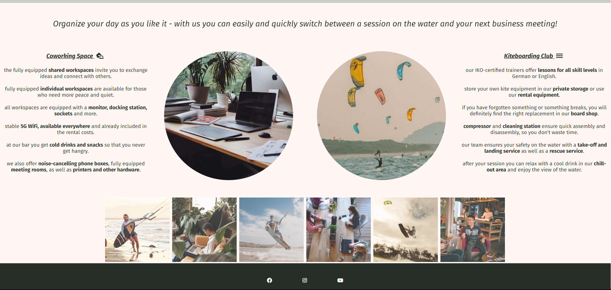

* Contact Us Page:
  
  * a contact form that you can use to contact the work&kite team to ask questions or make a reservation.
  * a reset and a submit button.
  * A photo of the team so that the user feels personally cared for.
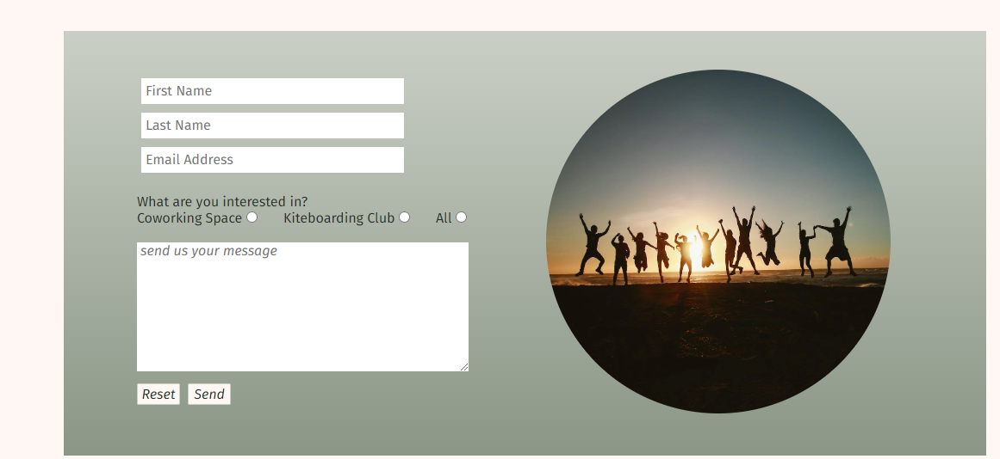

* Future Implementations:

  * Calendar display for reservations.
  * Reservation tool - to be able to book reservations directly.
  * detailed list of rental equipment and price list.

### Accessibility

While coding, I made sure to make everything as accessible as possible by:

* using semantic HTML.
* using descriptive alt attributes on images on the site.
* ensuring that there is a sufficient colour contrast throughout the site.
* ensuring menus are accessible by marking the current page as current for screen readers.

- - - 

## Technologies Used

### Languages Used

I used html and css to create this page:

* Balsamiq -for wireframes.
* Codeanywhere - for version control.
* Github - save and store files.
* Google Fonts - imports the fonts used on the website.
* Font Awesome - for the icons on the website.
* Chrome Dev Tools - for troubleshooting and solve issues with responsive and styling.
* img2go - to resize and compress images.
* Am I Responsive - to show the website image on different devices.

- - -

## Deployment & Local Development

### Deployment

Github was used to deploy the live website. Below the instructions to achieve this:

1. Log in to Github.
2. Find the right repository for this project.
3. Click on Settings.
4. Click on the "Pages" link in the left side navigation bar.
5. In the Source section, choose main from the drop down menu.
6. Click save and refresh the page.
7. Your live Github Pages site is now deployed and is displayed.

### Local Development

#### How to Fork

To fork the work&kite repository:

1. Log in to Github.
2. Find the right repository for this project.
3. Click the Fork button in the top right corner.

#### How to Clone

To clone the work&kite repository:

1. Log in to GitHub.
2. Find the right repository for this project.
3. Click the code button, select whether you would like to clone with HTTPS, SSH or GitHub CLI and copy the link shown.
4. Open the terminal in your code editor and change the current working directory to the location you want to use for the cloned directory.
5. Type 'git clone' into the terminal and then paste the copied link from step three in.
6. Press enter.

- - -

## Testing

I kept testing throughout the build process. For this I used Chrome Dev Tools. With this I was able to make the difficulties with the responsiveness and localize various style adjustments and adapt them accordingly.

Through my mentoring session, I was able to fix a display issue in my main section. Display: flex; brought the desired success.

### W3C Validator

The W3C validator was used to validate the HTML on all pages of the website. It was also used to validate CSS in the style.css file.

* Index Page HTML:
  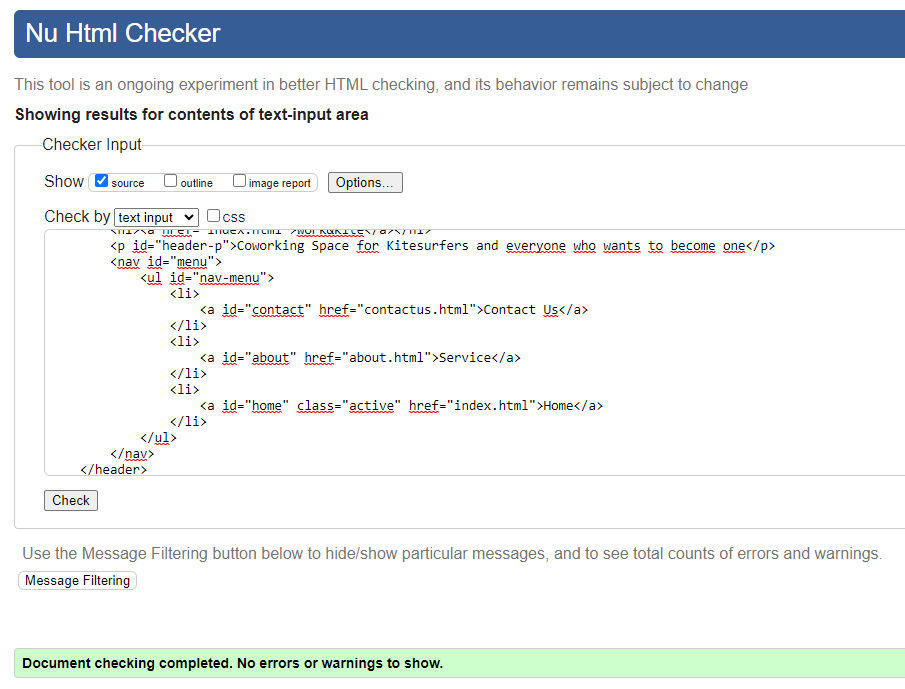
  
* Service Page HTML:
  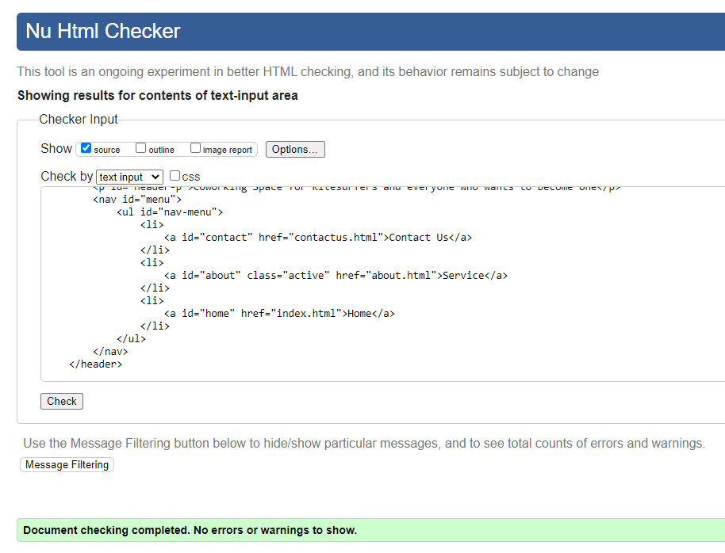
  
* Contact Us Page HTML:
  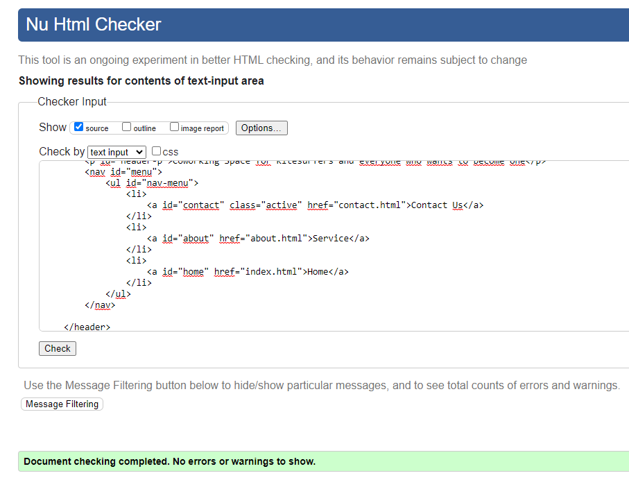

* CSS style Page:
  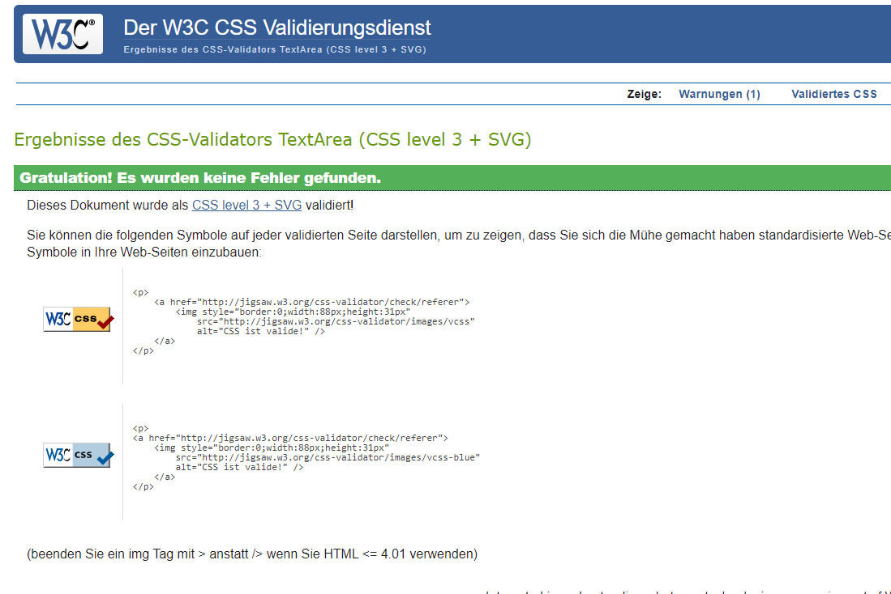

### Known Bugs

1. In Codeanywhere there is always a problem message regarding the implementation of my Google font. This issue was discussed with my mentor. He assured me that it was not a problem and that no solution could be offered. An internet search did not bring the desired information either.
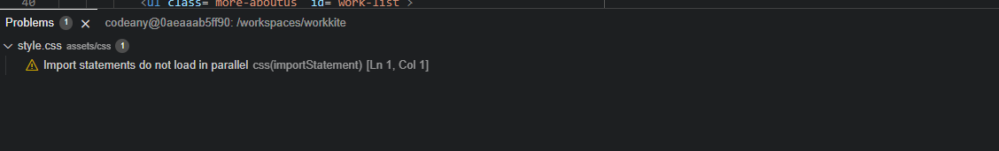

### Testing User Stories

* First Time Visitors:
  
  * I want to find out what work&kite is and what is offered. The main section of the home page explains what we are.
  * I want to be able to navigate the site easily to find information. The site navigation is in the top navigation bar, which consistently appears on all pages of the site.
  * I want to be able to find their social media accounts.

* Returning Visitors:

  * I want to know when which events are taking place.
  * I want to ask a question or make a reservation.

### Lighthouse

I used Lighthouse within the Chrome Developer Tools to allow me to test the performance and accessibility of the website.

* Homepage:
  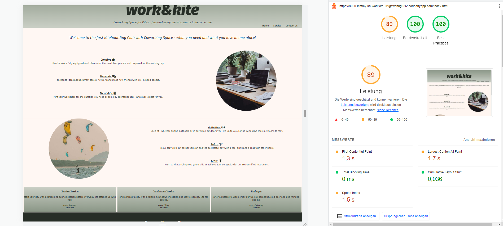

* Service Page:
  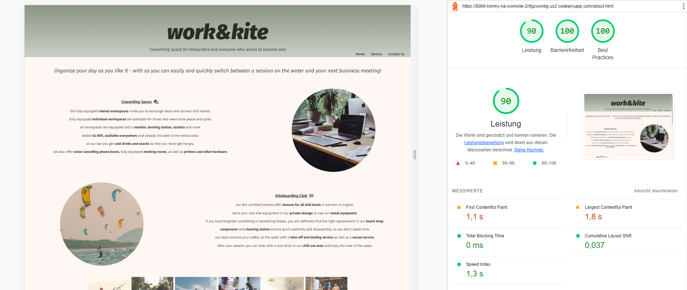

* Contact Us Page:
  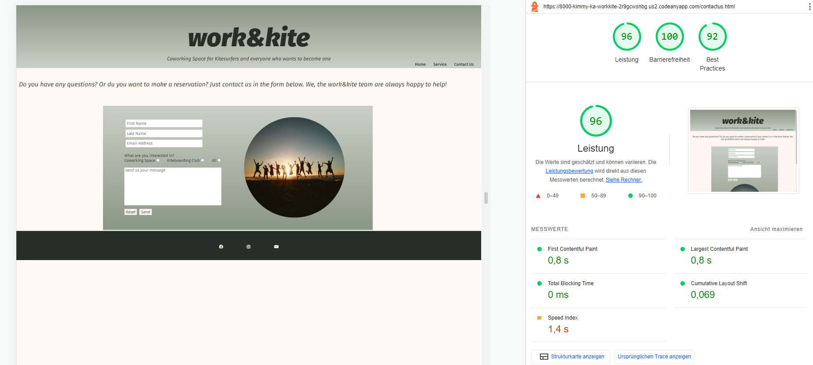

  
- - -

## Credits

### Code

In order to get my desired result, internet research was unavoidable.

For this I used:
* [selfhtml](https://wiki.selfhtml.org/)
* [w3Schools](https://www.w3schools.com/)
* [stackoverflow](https://stackoverflow.com/)

### Media

#### Images

All images used on the webpage are from:
* [Pexels](https://www.pexels.com/de-de/)

### Acknowledgments

I would like to acknowledge the following people who helped me along the way in completing my first milestone project:

* my wonderful husband René, without his good encouragement I would not have made it.
* my Code Institute Mentor, Akshat Garg.